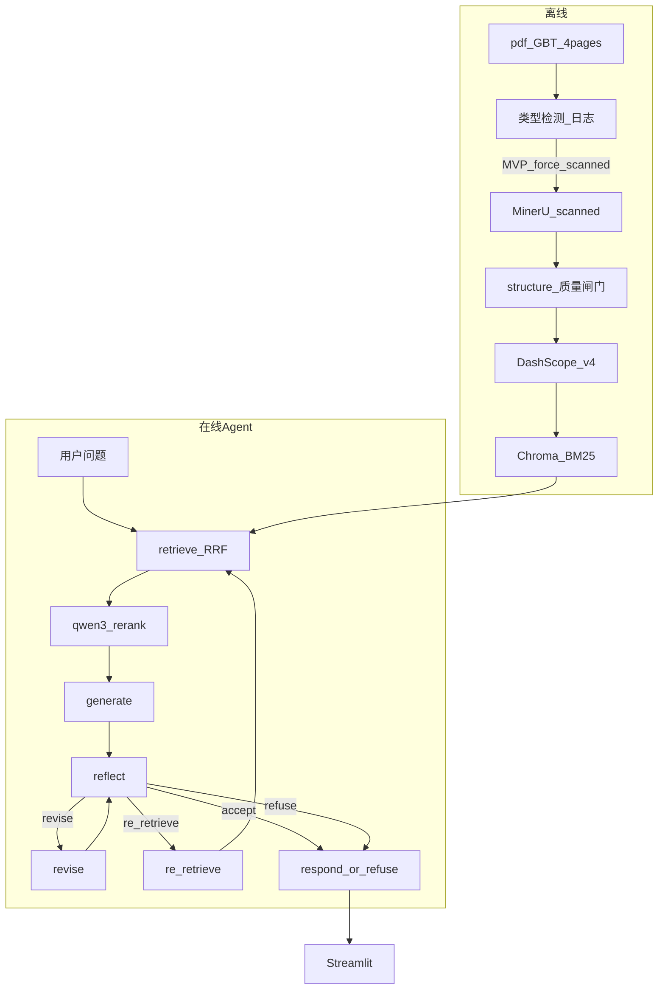

> **历史参考**：本文记录需求讨论/计划快照，实现以 [architecture.md](../overview/architecture.md)、[README.md](../../README.md) 及 `src/` 代码为准。最后归档：2026-05-26。

# Homework Understanding and Work Plan

> 智能文档问答 Agent 原型 — 对出题要求的理解、评审关注点回应与实施计划  
> 关联文档：[homework-original-requirements.md](../reference/homework-original-requirements.md)（出题方原文） · [requirements-discussion-log.md](./requirements-discussion-log.md) · [project-work-session-log.md](../reference/project-work-session-log.md)  
> 代码级规范（现行）：[evaluation-spec](../evaluation/evaluation-spec.md) · [structure-spec](../ingest/structure-spec.md) · [rerank-spec](../retrieval/rerank-spec.md) · [agent-and-refusal-spec](../agent/agent-and-refusal-spec.md) · [usage-and-cost-spec](../evaluation/usage-and-cost-spec.md)

---

## 一、我对作业的理解

### 1.1 背景在考什么

作业模拟的是**真实 B 端交付**，而不是课堂 ChatPDF：

- 输入是**扫描版 PDF**（无可靠文本层），含中文正文、**条款编号**、**表格**。
- 附件 `GBT 1568-2008 键 技术条件.pdf` 代表国标/标准类文档；背景中还提到合同、手册、金融、合规等，说明方案应具备**可迁移性**。
- 公司语境是**自研大模型 + Agent 框架**：评价重点在「能解释、能测试、能定位、能扩展」，而非仅「能聊」。

**硬性约束**：不得手工录入全文绕过解析——解析链路必须是可展示、可审计的一环。

### 1.2 七步闭环 = 验收清单


| 步骤  | 作业表述            | 我的理解（何谓「做完」）                                          |
| --- | --------------- | ----------------------------------------------------- |
| 1   | PDF 类型判断 → 解析策略 | 能输出 `scanned/text/mixed` 及对应策略（MinerU vs 直抽），可日志/配置说明 |
| 2   | 正文、条款编号、表格      | 结构化产物含 `clause_id`、表格 MD/HTML；可在 UI/文件中预览             |
| 3   | 可检索知识库          | 向量 + 关键词（或混合），chunk 带页码与类型元数据                         |
| 4   | 接收问题、检索证据       | 混合检索可调试；能展示 Top-K 证据片段                                |
| 5   | 生成答案 + 来源       | 答案带 `page`、片段、条款/表引用，非泛泛「根据文档」                        |
| 6   | 基本自检            | 显式输出：是否有依据、幻觉风险、是否拒答；最好可见反思过程                         |
| 7   | 测试与业务保障         | 自动化评测脚本 + README 说明金融/合规等场景的迁移与边界                     |


### 1.3 提交与评审在考什么

**提交物**：GitHub 仓库 + README + 演示（5–10 分钟视频或截图），须覆盖启动、解析、≥5 问（含 **1 表格 + 1 无答案**）、引用与自检、评测脚本结果。

**评审强调**（对应我的设计回应）：


| 评审点                  | 我的回应策略                                                |
| -------------------- | ----------------------------------------------------- |
| 识别 OCR/表格/检索/自检等关键问题 | 扫描件走 MinerU；表独立块；BM25 补条款号；LangGraph Reflexion 自检     |
| 合理 Agent/RAG，非套壳     | 离线 ingest 管道 + 在线 **证据锚定 Reflexion** 状态图，README 画清数据流 |
| 有效测试                 | `demo_questions.json`（8 题）+ `evaluate.py` 高严格：正文/表/拒答/**模糊/OCR/回归** |
| 业务迁移说明               | README「场景与保障」：金融/合规/标准文档的差异与配置项                       |
| 善用 AI 且负责            | 开源解析 + 自研可靠性层；评测可回归；关键输出结构化 JSON                      |
| 工程交付习惯               | `.env.example`、日志、异常、可复现启动、文档齐全                       |


**质量优先**：功能可裁剪，但**思路、取舍、测试、可解释性**不可缺。

---

## 二、问题定义与范围

### 2.1 本题要解决的问题

在给定**单份国标扫描 PDF** 上，构建最小可用的 **Document QA Agent**：

```text
PDF → 理解（解析+结构化）→ 索引 → 提问 → 检索 → 生成 → 自检/拒答 → 可评测交付
```

### 2.2 MVP 范围（必须交付）

- 单 PDF：`pdf/GBT 1568-2008 键 技术条件.pdf`（4 页扫描件）
- 全流程可跑通一次 ingest + 多次问答
- Streamlit 演示 + `evaluate.py` 高严格报告
- LangGraph：**retrieve → rerank → generate → reflect →（revise \| re_retrieve）→ respond/refuse**
- **一期必做**：`qwen3-rerank`、`re_retrieve`（1 次）、Token 审计、8 题评测集

### 2.3 明确不做（MVP）

- 多文档库、多租户、权限
- 纯 RAGFlow/Dify 零代码交作业
- 手工录入文本
- GraphRAG、复杂多 Agent 协作
- text/mixed PDF 演示分支（**P7 低优先级**，全链路通过后确认）

---

## 三、技术方案总览（已确认）

### 3.1 路线：路径 2

**MinerU（解析）+ 薄 RAG（索引/检索）+ LangGraph Reflexion（在线 Agent）+ Streamlit（体验）**

选用原因（相对全自研 / 纯 RAGFlow）：

- 少从零写 OCR/表格，但保留**条款结构化、评测、自检**等可答辩模块。
- 符合「Agent 框架 + 可测试 + 可解释」评分标准。

### 3.2 架构图




### 3.3 技术栈一览


| 层次        | 技术                                      | 作用                     |
| --------- | --------------------------------------- | ---------------------- |
| PDF 检测    | PyMuPDF                                 | scanned / text / mixed |
| 解析        | MinerU                                  | 扫描件 → MD/JSON + 表格     |
| 结构化       | 自研 `structure.py`                       | 条款号、表块、元数据             |
| 分块        | 结构感知 600–800 token，15–20% overlap（见 `indexing-and-retrieval.md`） | 国标条款/表块 |
| 稠密索引      | 正文 + ARK 预设问句双写 Chroma（`INDEX_HYPOTHETICAL_QUESTIONS`） | 口语问法召回 |
| Embedding | **DashScope text-embedding-v4**（1024 维） | 在线稠密向量                 |
| 向量库       | Chroma                                  | 持久化                    |
| 关键词       | BM25                                    | 条款号/表号                 |
| 融合        | RRF，Top-K=12 → Rerank Top-5              | 召回 + 精排                |
| Rerank      | **DashScope qwen3-rerank**（降级 local BGE） | 条款/表题精排               |
| 生成/反思     | **ARK**（OpenAI 兼容 API）                  | 草稿、批判、修订、query 改写      |
| 编排        | **LangGraph**（仅 query 子图）               | Self-Reflection 状态机    |
| UI        | Streamlit                               | 演示与解析预览                |
| 配置        | `.env`                                  | 密钥与参数                  |


---

## 四、模块设计与职责


| 模块     | 路径（规划）                                        | 职责                          |
| ------ | --------------------------------------------- | --------------------------- |
| 配置     | `src/config/settings.py`                      | 读取 `.env`，统一参数              |
| PDF 检测 | `src/pdf/detector.py`                         | 类型判断与策略路由                   |
| 解析     | `src/pdf/parsers/mineru.py`                   | 调用 MinerU，落盘 MD/JSON        |
| 结构化    | `src/pdf/structure.py`                        | 条款/表/页码 → `doc.json`        |
| 分块     | `src/indexing/chunker.py`                     | 结构感知分块                      |
| 向量化    | `src/indexing/embedder.py`                    | DashScope v4 分批 embed       |
| 索引     | `src/indexing/indexer.py`                     | Chroma + BM25 构建            |
| 检索     | `src/retrieval/retriever.py`                  | RRF、硬拒答门禁、编号增强               |
| 重排     | `src/retrieval/reranker.py`                   | qwen3-rerank / 降级链              |
| 可观测    | `src/observability/usage.py`                  | Token JSONL、成本汇总              |
| 评测     | `src/evaluation/llm_judge.py`                 | 高严格 LLM Judge                 |
| LLM    | `src/llm/ark_client.py`                       | ARK Chat                    |
| 生成     | `src/generation/answerer.py`                  | 约束式草稿与引用格式                  |
| Agent  | `src/agent/query_graph.py`（**已过时**：无 `nodes/` 子目录） | LangGraph Reflexion         |
| 编排     | `src/agent/orchestrator.py`                   | `ingest()` / `ask()` 对外 API |
| 入库脚本   | `scripts/ingest.py`                           | 一键 ingest                   |
| 评测     | `scripts/evaluate.py` + `demo_questions.json` | 命中率、拒答、引用                   |
| 演示     | `app/streamlit_app.py`                        | UI                          |
| 文档     | `README.md`、`docs/`*                          | 复现与取舍                       |


---

## 五、Agent / RAG 流程说明（非简单套壳）

### 5.1 离线：文档理解管道

1. **检测**：按页统计可提取文本量 → `scanned|text|mixed`（MVP 仅执行 scanned，检测写日志）。
2. **解析**：**MinerU**（`MVP_FORCE_SCANNED=true`；禁止手打全文）。
3. **结构化**：正则 + 规则聚合 `4.1.2`、`表 1`、`附录` 等；表格 `chunk_type=table`。
4. **索引**：在线 **v4** 写 Chroma；**BM25** 必留（v4 无稀疏，条款号靠 BM25）。

### 5.2 在线：证据锚定 Reflexion

```text
retrieve → rerank → generate(仅证据) → reflect → accept | revise(≤2) | re_retrieve(≤1) | refuse
```

详见 [agent-and-refusal-spec.md](../agent/agent-and-refusal-spec.md)。`reflect` 字段：`has_evidence`、`hallucination_risk`、`should_refuse`、`action`（含 `re_retrieve`）。

**拒答优先级**：索引无效 → 检索双低分硬门禁 → reflect 拒答/高风险 → re_retrieve 用尽仍低分。

### 5.3 与「评委六问」的对应


| 评委关心   | 设计落点                          |
| ------ | ----------------------------- |
| OCR/扫描 | MinerU + 检测路由                 |
| 表格     | 表独立块 + 表格样例题                  |
| 检索     | 混合检索 + 可展示 evidence           |
| 生成     | ARK + 强制引用格式                  |
| 自检     | reflect/revise，UI 展示 critique |
| 可测试    | evaluate.py 8 题 + 高严格指标 + Token 报告 |


---

## 六、测试与验证计划

> 完整指标与阈值见 [evaluation-spec.md](../evaluation/evaluation-spec.md)。

### 6.1 演示必测问题（`demo_questions.json`，**8 题 MVP**）

| 类型 | category | 预期 |
|------|----------|------|
| 范围/术语 | scope | 有引用，accept |
| 条款 | clause | 命中 `clause_id`，`clause_retrieval_hit` |
| **表格** | table | Top-K 含 `chunk_type=table` |
| 综合 | composite | 多条引用 |
| **无答案** | out_of_scope | `should_refuse=true`，`refuse_accuracy=100%` |
| **模糊** | fuzzy | `fuzzy_recall_pass` |
| **OCR** | ocr_robust | `ocr_robust_pass` |
| **回归** | regression（q8a/q8b） | `regression_consistency` |

### 6.2 自动化评测（`evaluate.py`）

- 输入：8 题 + 已 ingest 索引。  
- 输出：`artifacts/eval_report.json`（硬性指标 + `eval_overall_pass` + `cost_summary`）。  
- 高严格：`EVAL_PASS_STRICT=true`；语义题启用 LLM Judge（≥80%）。  
- 演示材料第 5 项：终端或报告截图。

### 6.3 非功能验证

- 无 Key / PDF 缺失 / MinerU 失败：明确错误信息。  
- ingest 可重复执行（覆盖或版本化 `artifacts/`）。  
- 日志含阶段耗时，便于定位「解析 vs 检索 vs 生成」。

---

## 七、边界情况与应对


| 边界         | 风险     | 保障                        |
| ---------- | ------ | ------------------------- |
| 扫描模糊/倾斜    | OCR 错字 | 展示原文片段；低置信可降权；README 说明局限 |
| 表格跨页/错行    | 表题答案错  | 表独立块；表格专测；MinerU 参数可调     |
| 条款号 OCR 错误 | 检索失败   | BM25 + 模糊匹配；保留页码检索        |
| 相似条款干扰     | 答非所问   | Top-K + reflect 剔除无依据句    |
| 文档外问题      | 幻觉     | 检索阈值 + **拒答** + reflect   |
| API 失败     | 不可用    | 重试、分批 embed（≤10 条）、配置校验脚本 |


---

## 八、业务场景迁移（作业第 7 步）


| 场景          | 与 GBT 国标差异  | 迁移要点                                       |
| ----------- | ----------- | ------------------------------------------ |
| **标准/合规文件** | 与本题最接近      | 强化条款号分块、版本号元数据、拒答模板                        |
| **金融研报**    | 多栏、数字密、公司实体 | 结构分块 + BM25 实体；Embedding 已用 v4；可加 Reranker |
| **合同**      | 章节+定义项      | 识别「甲方乙方」「第 X 条」；引用需条款级                     |
| **产品手册**    | 图文多         | MinerU 图注；可选多模态（二期）                        |
| **客户交付**    | 审计          | 日志、evaluate 报告、配置化阈值、证据链导出                 |


README 将专设「场景与保障」小节，说明**改配置即可 vs 需改模块**。

---

## 九、工程交付与仓库结构（计划）

```text
pdf-agent/
├── README.md                 # 安装、启动、演示、取舍、场景迁移
├── requirements.txt
├── .env.example
├── pdf/                      # GBT PDF（作业附件）
├── artifacts/                # parsed / chroma / eval 报告
├── scripts/
│   ├── ingest.py
│   ├── evaluate.py
│   └── demo_questions.json
├── src/
│   ├── config/
│   ├── pdf/
│   ├── indexing/
│   ├── retrieval/
│   ├── llm/
│   ├── generation/
│   └── agent/
├── app/streamlit_app.py
└── docs/
    ├── homework-understanding-and-work-plan.md
    ├── requirements-discussion-log.md
    ├── evaluation-spec.md
    ├── structure-spec.md
    ├── rerank-spec.md
    ├── agent-and-refusal-spec.md
    ├── usage-and-cost-spec.md
    ├── EMBEDDING.md
    └── project-work-session-log.md
```

**工程习惯**：`logging` 分阶段、`pydantic` 校验 Reflection JSON、依赖版本锁定、演示前固定 ingest 一次。

---

## 十、工作计划与里程碑

### 10.1 阶段划分


| 阶段 | 内容 | 产出 | 参考工期 |
|------|------|------|----------|
| **P0** | 需求沟通 | 本文档 + Baseline + spec | ✅ 沟通完成 |
| **P0.5** | MinerU POC | 校准 structure 闸门（见 structure-spec 附录） | 0.5 天 |
| **P1** | 脚手架 | `requirements.txt`、`settings`、目录 | 0.5 天 |
| **P2** | 解析与结构化 | MinerU + `structure` + 质量闸门 | 1～1.5 天 |
| **P3** | 索引与检索 | v4 + Chroma + BM25 + **qwen3-rerank** | 0.5～1 天 |
| **P4** | Agent | LangGraph + **re_retrieve** + Reflexion | 1～1.5 天 |
| **P5** | 演示与评测 | Streamlit + **8 题** evaluate + usage | 1 天 |
| **P6** | README 与录制 | 评委 git clone 可复现 | 0.5～1 天 |
| **P7** | text/mixed 分支 | 可选，完成后询问 | 低优先级 |

**MVP 合计**：约 **5.5～7 人天**（含 Rerank、re_retrieve、高严格评测）。

### 10.2 提交前检查清单

- GitHub 仓库结构清晰，无密钥提交  
- README：复现步骤、架构图、取舍、场景迁移  
- `python scripts/ingest.py` 成功  
- Streamlit 可看解析正文+表  
- ≥8 问评测（含表格 + 无答案 + fuzzy/OCR/回归），有引用与自检展示  
- `eval_overall_pass=true` 截图  
- `python scripts/evaluate.py` 有报告截图  
- 演示视频或截图集（5–10 分钟等效）

### 10.3 风险与缓冲

- PDF 路径：`pdf/GBT 1568-2008 键 技术条件.pdf`。  
- MinerU 环境安装 → README 写明系统依赖。  
- 表格题不达预期 → 预留 0.5 天调 MinerU/分块。

---

## 十一、思路与取舍（答辩用短答）

### 11.1 非套壳三层（评委叙事）

1. **文档理解层**：检测日志 + `structure.py` 质量闸门 + 条款/表元数据（非 MinerU 直塞向量库）
2. **检索层**：RRF + **qwen3-rerank** + BM25 + **re_retrieve**（证据与轮次可展示）
3. **可靠性层**：LangGraph Reflexion + 拒答优先级链 + 高严格 `evaluate.py` + Token 审计

### 11.2 技术取舍表

| 取舍 | 选择 | 理由 |
|------|------|------|
| 解析 | MinerU | 扫描+表格成熟 |
| Rerank | **qwen3-rerank**（非 DeepSeek） | 与 v4 同 Key；DeepSeek 无 Rerank API |
| Agent | LangGraph + re_retrieve | 状态机可解释；一期必做二次检索 |
| 反思 | 完整 Reflexion（≤2 轮）+ 规则闸门 | 非简化单轮方案 |
| Embedding | DashScope v4 | 已定稿 |
| Chat | ARK | 公司栈 |
| BM25 | 保留 | 条款号/表号 |
| 评测 | 8 题 + LLM Judge | 覆盖模糊/OCR/回归 |


---

## 十二、文档修订


| 日期         | 版本   | 说明                           |
| ---------- | ---- | ---------------------------- |
| 2026-05-21 | v1.0 | 初版：作业理解 + 工作计划，对齐路径 2 与已定技术栈 |
| 2026-05-21 | v1.1 | 计划确认：re_retrieve、qwen3-rerank、8 题高严格评测、5 份 spec、P0.5 POC |


---

*（归档）开发过程中 Baseline 见同目录 [requirements-discussion-log.md](./requirements-discussion-log.md)；现行以 [evaluation-spec.md](../evaluation/evaluation-spec.md) 与代码为准。*