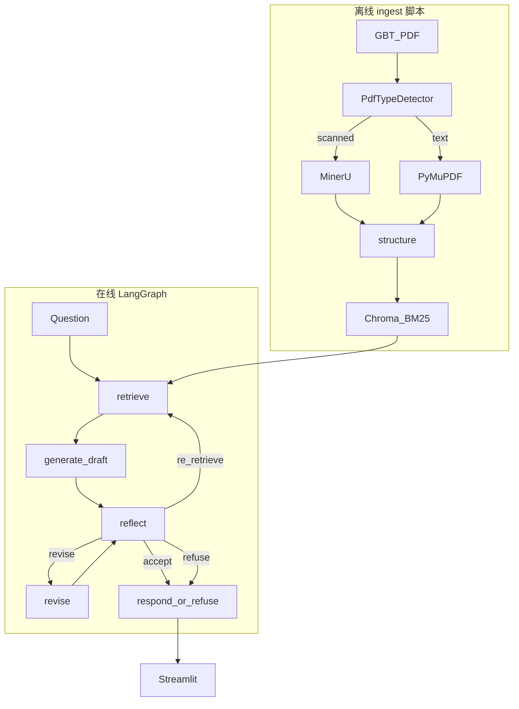

> **历史参考**：本文记录需求讨论/计划快照，实现以 [architecture.md](../overview/architecture.md)、[README.md](../../README.md) 及 `src/` 代码为准。最后归档：2026-05-26。

# Requirements Discussion Log

> 智能文档问答 Agent 作业 — 多轮需求沟通与方案共识记录  
> 文档用途：后续开发与沟通时对齐范围，避免偏离轨道。  
> 最后更新：2026-05-21（v1.3：一期 MVP 含 re_retrieve、qwen3-rerank、高严格评测）

---

## 1. 文档说明


| 项     | 内容                                                         |
| ----- | ---------------------------------------------------------- |
| 项目名称  | pdf-agent（智能文档问答 Agent 原型）                                 |
| 工作区   | `/Users/lijq/Documents/code/pdf-agent`（起步时为空仓库）            |
| 本文档角色 | 记录作业背景、目标、技术选型演变、已确认决策、未决事项与风险                             |
| 关联计划  | Cursor 计划：`智能文档问答 Agent`（路径 2 + LangGraph Reflexion 为当前首选） |
| 工期记录  | [project-work-session-log.md](../reference/project-work-session-log.md)（事项 + 开始/结束时间） |
| 作业原始需求（原文） | [homework-original-requirements.md](../reference/homework-original-requirements.md) |
| 作业理解与计划 | [homework-understanding-and-work-plan.md](./homework-understanding-and-work-plan.md) |
| 代码级规范 | [evaluation-spec](../evaluation/evaluation-spec.md)、[structure-spec](../ingest/structure-spec.md)、[rerank-spec](../retrieval/rerank-spec.md)、[agent-and-refusal-spec](../agent/agent-and-refusal-spec.md)、[usage-and-cost-spec](../evaluation/usage-and-cost-spec.md) |


---

## 2. 作业背景与目标（来自出题方）

### 2.1 背景

- 场景：自研大模型产品公司的 **Agent 框架** 能力验证。
- 输入：客户常见非结构化资料；本作业附件为 **扫描版 PDF**（无可靠文本层）。
- 样例文件：`GBT 1568-2008 键 技术条件.pdf`（中文正文、条款编号、表格）。
- **硬性约束**：不得手工录入全文绕过解析。

### 2.2 必须完成的七步闭环


| 步骤  | 能力              | 验收要点                            |
| --- | --------------- | ------------------------------- |
| 1   | PDF 类型判断 → 解析策略 | 标明 `scanned` / `text` / `mixed` |
| 2   | 提取正文、条款编号、表格    | 可查看结构化解析结果                      |
| 3   | 构建可检索知识库        | 向量 + 元数据（页码、条款号、块类型）            |
| 4   | 接收问题并检索证据       | 检索可调试、可说明                       |
| 5   | 生成答案并返回来源       | 页码 / 片段 / 条款号引用                 |
| 6   | 答案自检            | 有依据、幻觉风险、是否拒答                   |
| 7   | 测试方法与业务保障       | 评测脚本 + README 场景说明              |


### 2.3 提交物

1. **GitHub 代码库**（结构清晰）
2. **README**（可复现）
3. **演示材料**（5–10 分钟视频或截图），须包含：
  - 部署/启动全流程
  - PDF 解析结果（正文 + 表格）
  - ≥5 个问答（含 **1 个表格题** + **1 个无答案/拒答题**）
  - 来源引用与自检结果
  - 测试/评估脚本运行结果

### 2.4 公司内技术约束（用户规则）

- 涉及 LLM 的场景，参照项目 **火山方舟 ARK**（OpenAI 兼容 API，`https://ark.cn-beijing.volces.com/api/v3`）。
- 用户沟通语言：**简体中文**。

---

## 3. 沟通过程摘要（按主题）

### 3.1 初版方案（全自研）

- **解析**：PyMuPDF 检测 + **PaddleOCR / PP-Structure**（本地 OCR）。
- **索引**：Chroma + BM25（RRF 融合），条款感知分块。
- **Agent**：自研 Orchestrator 流水线（非第三方 Agent 框架）。
- **UI**：**Streamlit**（用户已确认）。
- **LLM**：ARK Chat（生成/反思）；**Embedding**：DashScope **text-embedding-v4**（用户已定稿）。

### 3.2 Agent 框架讨论


| 问题                     | 结论                                                               |
| ---------------------- | ---------------------------------------------------------------- |
| 是否用 LangGraph？         | **采用**，但仅 **在线 query 子图**（部分链路），ingest 用脚本管道                     |
| 全链路 vs 部分链路 LangGraph？ | **部分链路**；ingest（OCR/建库）不进图                                       |
| 与「自研 Orchestrator」关系   | 在线层用 LangGraph 表达状态机；对外仍可有 `orchestrator.py` 封装 `ingest` / `ask` |


### 3.3 RAGFlow 调研（用户主动提出）

- 用户初衷：在 GitHub 找 **贴合需求的开源项目**，减少从 0 开发。
- **RAGFlow**（[infiniflow/ragflow](https://github.com/infiniflow/ragflow)）评估结论：
  - **适合**：扫描 PDF、DeepDoc/MinerU、Laws 分块、引用、演示 UI。
  - **不足**：作业第 6 步三字段自检需自研；纯部署 UI 不足以体现「自行设计」。
  - **推荐用法**：**模式 B** — RAGFlow 作引擎 + 本仓库 `docker-compose` / `evaluate.py` / Verifier 节点封装。
- **未选为唯一主路径原因**：与「LangGraph Agent 叙事 + 解析可解释」的平衡下，后续更倾向 **路径 2**。

### 3.4 开源选型调研（三类）

**A. 一站式平台**


| 项目              | 扫描+表格     | 备注                |
| --------------- | --------- | ----------------- |
| RAGFlow         | 强         | 首选平台型备选           |
| Tencent/WeKnora | 强         | DocReader + ReACT |
| MaxKB / FastGPT | 中         | 部署快，深解析弱于 RAGFlow |
| Dify            | 弱（扫描 PDF） | 不推荐主引擎            |
| kotaemon        | 中         | 引用 UI 好，OCR 需实测   |


**B. 解析引擎（只解决 1–2 步）**


| 项目         | 备注             |
| ---------- | -------------- |
| **MinerU** | **路径 2 首选**    |
| Docling    | 备选             |
| PaddleOCR  | 路径 3 / 路径 2 备选 |
| marker     | 备选             |


**C. 轻量参考**

- Local_Pdf_Chat_RAG（FAISS+BM25，无 OCR）
- ChatPDFchinese（中文分块，偏文本 PDF）

### 3.5 三条落地路径对比（已讨论透）


| 路径    | 概要                         | MVP 人天（熟练 / 初学）                     | 定位       |
| ----- | -------------------------- | ----------------------------------- | -------- |
| **1** | RAGFlow + 薄封装              | 2.5–3 / 5–6（后修正为 4–5.5 / 6–7.5 含缓冲） | 最快演示     |
| **2** | MinerU + 薄 RAG + LangGraph | 4–5 / 7–8（计划表 5.5–7.5）              | **共识首选** |
| **3** | PaddleOCR 全自研              | 6–7 / 9–11                          | 极致可控     |


**用户倾向**：少从 0 写、能讲清架构；**认同路径 2**。

---

## 4. 当前已确认决策（Baseline）

以下作为后续开发的 **不可随意偏离项**，变更需在本文件追加修订记录。


| #   | 决策项                 | 确认内容                                                                                                                          |
| --- | ------------------- | ----------------------------------------------------------------------------------------------------------------------------- |
| D1  | **主路径**             | **路径 2**：MinerU 解析 + 薄 RAG + LangGraph（仅在线 query）                                                                             |
| D2  | **解析**              | 扫描件：**MinerU** CLI/API → MD/JSON；文本层：**PyMuPDF** 直抽；**PdfTypeDetector** 路由                                                    |
| D3  | **结构化**             | 自研 `structure.py`：条款号、表格块、`clause_id` / `chunk_type`                                                                          |
| D4  | **知识库 / Embedding** | **阿里云 DashScope `text-embedding-v4`**（在线）；Chroma 存稠密向量；**BM25 + RRF**；默认维度 **1024**；ingest 批量 **每批≤10 条** |
| D4a | **Rerank（一期）** | **DashScope `qwen3-rerank`** 主路径；RRF Top-12 → Top-5；降级 `local_bge` → RRF Top-5；见 `docs/retrieval/rerank-spec.md` |
| D4c | **re_retrieve（一期）** | `reflect.action=re_retrieve` → `rewrite_query` → `retrieve`；`MAX_RE_RETRIEVE=1`；见 `docs/agent/agent-and-refusal-spec.md` |
| D4b | **分块**              | **结构感知递归**；目标 **600–800 token**，重叠 **15–20%**；表格/条款独立块；禁止固定 512、禁止纯语义分块                                                       |
| D5  | **LLM**             | **ARK**（`ark.cn-beijing.volces.com`）仅用于 generate / reflect / revise；**不使用火山 Embedding**                                       |
| D5b | **Embedding 接入**    | OpenAI 兼容：`base_url=https://dashscope.aliyuncs.com/compatible-mode/v1`；环境变量 `DASHSCOPE_API_KEY`；详见 `docs/retrieval/EMBEDDING.md`        |
| D6  | **Agent 编排**        | **LangGraph Reflexion 子图**（见 §5），非 RAGFlow Agent、非全自研 if-else                                                                 |
| D7  | **Self-Reflection** | **必须包含**；`reflect` + `revise`，`MAX_REFLECTION=2`（MVP）                                                                         |
| D8  | **UI**              | **Streamlit**（解析预览、问答、引用、反思过程、自检 JSON）                                                                                        |
| D9  | **评测**              | `scripts/evaluate.py` + `demo_questions.json`（**≥8 题**：5 类提交 + fuzzy/OCR/回归）；高严格指标 + LLM Judge；见 `docs/evaluation/evaluation-spec.md` |
| D11 | **Token 审计**        | `src/observability/usage.py`；JSONL + `eval_report.cost_summary`；见 `docs/evaluation/usage-and-cost-spec.md` |
| D12 | **MVP 解析**        | `MVP_FORCE_SCANNED=true`；PDF 路径 `pdf/GBT 1568-2008 键 技术条件.pdf`；text/mixed 分支 **P7 低优先级** |
| D10 | **仓库职责**            | 开源负责重引擎；本 repo 负责 **检测路由、结构化、索引、Agent、自检、评测、文档**                                                                              |


### 明确不做 / 降级为备选

- ❌ 纯 RAGFlow UI 交作业（无自研代码与评测）
- ❌ 全链路 LangGraph 包 OCR ingest（默认不做）
- ❌ 手工录入 PDF 全文
- ⏸ 路径 1（RAGFlow 封装）、路径 3（Paddle 全自研）：**备选**，非当前主线
- ⏸ CrewAI / AutoGen 多 Agent：过重，不采用
- ⏸ text/mixed PDF 演示分支：**P7**，全链路通过后由用户确认是否做

---

## 5. 目标架构（路径 2 + Reflexion）

### 5.1 总览




### 5.2 LangGraph 节点与状态

**状态字段（`AgentState`）**：`question`, `evidence[]`, `draft_answer`, `reflection_notes[]`, `reflection_count`, `final_answer`, `verification{}`


| 节点                   | 职责                                   |
| -------------------- | ------------------------------------ |
| `retrieve`           | 混合检索；无命中 / 低分 → `refuse`             |
| `generate`           | 仅基于 evidence 生成草稿 + 引用 `[p.N         |
| `reflect`            | **Self-Reflection**：对照 evidence 批判草稿 |
| `revise`             | 按 critique 改稿（不超出 evidence）          |
| `respond` / `refuse` | 终态输出                                 |


`**ReflectionResult`（reflect 节点 JSON）**：

```json
{
  "has_evidence": true,
  "hallucination_risk": "low",
  "should_refuse": false,
  "unsupported_claims": [],
  "missing_citations": [],
  "critique": "...",
  "action": "accept|revise|re_retrieve|refuse"
}
```

**路由**：`accept→respond`；`revise` 且 `reflection_count<2→revise→reflect`；`re_retrieve`（完整版）；`refuse` 或 `hallucination_risk=high`。

### 5.3 计划代码结构（摘要）

```
pdf-agent/
├── docs/
│   ├── requirements-discussion-log.md   # 本文档
│   └── ARK.md
├── pdf/                                 # GBT PDF（作业附件）
├── artifacts/parsed/, artifacts/chroma/
├── scripts/ingest.py, evaluate.py, demo_questions.json
├── src/
│   ├── pdf/detector.py, structure.py
│   ├── pdf/parsers/mineru.py
│   ├── indexing/, retrieval/
│   ├── llm/ark_client.py
│   ├── generation/answerer.py
│   ├── agent/query_graph.py, state.py, nodes/
│   └── agent/orchestrator.py
└── app/streamlit_app.py
```

---

## 6. 各环节技术选型与平替（路径 2）


| 环节        | 选定                              | 平替                               | 选型理由                              |
| --------- | ------------------------------- | -------------------------------- | --------------------------------- |
| PDF 检测    | PyMuPDF                         | pdfplumber                       | 轻、可解释                             |
| 扫描解析      | **MinerU**                      | RAGFlow DeepDoc, Paddle, Docling | 表格+MD；省工程                         |
| 条款/表结构    | 自研正则+规则                         | LLM 抽结构, RAGFlow Laws            | 国标条款号可控                           |
| 向量库       | Chroma                          | FAISS, Milvus                    | 单文档 MVP 够用                        |
| Embedding | **DashScope text-embedding-v4** | BGE-M3 本地、ARK embed、Conan        | 用户定稿；在线中文文档；见 `docs/retrieval/EMBEDDING.md` |
| 关键词检索     | rank_bm25                       | ES、仅靠稠密向量                        | 条款号/表号/牌号（v4 无稀疏通道，**BM25 必留**）   |
| 重排        | **DashScope qwen3-rerank**（一期）   | 本地 `bge-reranker-v2-m3` 降级       | 与 v4 同 Key；见 `rerank-spec.md`   |
| 检索 K      | **10**（8–12）                    | 5                                | 降漏召                               |
| LLM       | ARK                             | DeepSeek API, Ollama             | 仅生成/反思                            |
| Agent     | **LangGraph**                   | 自研, RAGFlow 画布                   | 状态机+Reflection                    |
| UI        | Streamlit                       | Gradio, RAGFlow UI               | 已确认                               |


---

## 7. MVP 范围与工期（路径 2）

### 7.1 MVP 包含

- 单 PDF（GBT）ingest 成功，`artifacts/parsed/` 可预览
- Chroma + BM25 检索可用
- LangGraph：`retrieve → rerank → generate → reflect`；`revise`；`re_retrieve`（1 次）；`accept/refuse`
- Streamlit：8 题评测集（含 fuzzy/OCR/回归）、引用、**反思过程**、Token 摘要
- `evaluate.py` 输出报告
- README：安装、ARK、架构、取舍

### 7.2 MVP 不包含

- 多 PDF / 多租户
- GraphRAG
- 路径 1 RAGFlow 双轨
- text/mixed 解析演示（**P7 低优先级**）

### 7.3 工期参考（一人）


| 阶段                          | 熟练          | 初学          |
| --------------------------- | ----------- | ----------- |
| MinerU + 结构化                | 1–1.5 天     | 2 天         |
| 索引 + 检索                     | 0.5–1 天     | 1 天         |
| LangGraph + Reflexion       | 1–1.5 天     | 2 天         |
| Streamlit + 评测 + 文档         | 1 天         | 1.5 天       |
| **MVP 合计**                  | **约 4–5 天** | **约 7–8 天** |
| re_retrieve + qwen3-rerank + 8 题评测 | 含在 MVP 5.5–7 天 | 含在 MVP 5.5–7 天 |


---

## 8. 演示与评测样例（建议固定）

`scripts/demo_questions.json` 建议覆盖：


| 类型      | 示例方向           | 预期                    |
| ------- | -------------- | --------------------- |
| 范围/术语   | 本标准适用范围        | 有引用，reflect accept    |
| 条款      | 某条技术要求         | 命中 clause             |
| **表格**  | 表中尺寸/参数限值      | 命中 `chunk_type=table` |
| 综合      | 材料/热处理等        | 多段引用                  |
| **无答案** | 与标准无关问题（如蓝牙协议） | `should_refuse=true`  |


---

## 9. 风险与缓解


| 风险                       | 缓解                                                   |
| ------------------------ | ---------------------------------------------------- |
| MinerU 多页表/条款 OCR 错      | 实测 GBT PDF；不行调 MinerU 参数或后处理规则                       |
| ARK / DashScope Key 配置错误 | `.env.example` + `docs/integrations/ARK.md` + `docs/retrieval/EMBEDDING.md` |
| v4 批量超限（>10 条/请求）        | ingest 分批 `embed_batch_size=10`                      |
| Reflection 循环过多          | `MAX_REFLECTION=2`，评测监控轮次                            |
| 仓库无 PDF                  | ingest 脚本明确报错；README 说明放置路径                          |
| 偏离路径 2                   | 以本文档 §4 **已确认决策** 为准评审变更                             |


---

## 10. 外部建议补充：金融研报方案 → 国标项目适配（2026-05-21）

用户与其他模型讨论了**金融研报 PDF** 的 embedding / 分块 / 向量方案。以下为适用性分析，避免照搬错域配置。

### 10.1 场景差异（为什么不能原样照搬）


| 维度     | 金融研报（原建议场景）      | 本项目（GBT 1568-2008 国标）     |
| ------ | ---------------- | ------------------------- |
| 文档类型   | 券商研报、多栏、盈利预测     | **国家/行业标准**、条款编号、规范性引用    |
| 章节逻辑   | 行业概况、财务分析、风险提示   | **范围、技术要求、试验方法、附录**       |
| 关键检索词  | 公司名、营收、毛利率       | **条款号（4.1.2）、表1、材料、尺寸公差** |
| PDF 形态 | 多为电子版+部分扫描       | 作业给定 **扫描件为主**            |
| 解析工具   | pdfplumber + OCR | 已选 **MinerU**（表格/版面更强）    |


结论：原建议中的 **「金融专用模型名、研报章节规则」** 不直接套用；**「结构分块 + 混合检索 + 元数据」方法论** 高度可迁移。

### 10.2 建议采纳项（利于本项目）


| 原建议                                        | 本项目采纳方式                                                | 理由                              |
| ------------------------------------------ | ------------------------------------------------------ | ------------------------------- |
| 在线中文 Embedding                             | **DashScope text-embedding-v4**（**用户定稿 v1.2**）；BM25 必留 | 不跑本地 M3；条款号/表号靠 BM25            |
| 结构感知递归分块                                   | 在 MinerU MD 上按 `**#` 标题 → 条款号 → 段落 → 句** 递归切           | 与已定的 `structure.py`、clause 分块一致 |
| Chunk **600–800 token**，**15–20% overlap** | ingest 默认参数（约 1200–1500 汉字，overlap 100–150 token）      | 避免 512 截断跨句技术要求                 |
| **表格单独成块**                                 | 保持 `chunk_type=table`，带表题                              | 作业必考表格题                         |
| 元数据丰富                                      | `doc_id, page, clause_id, chunk_type, section_title`   | 引用与过滤；不需研报「公司/行业」字段             |
| 混合检索 + **RRF**                             | 维持 Chroma 向量 + BM25（或 M3 稀疏）+ RRF                      | 条款号/表号题必备                       |
| Top-**8–12**                               | retriever 默认 `k=10`                                    | 国标条款密，略增 k 降漏召                  |
| **BGE-Reranker**                           | **降级**：API 失败时本地 `bge-reranker-v2-m3`                 | 主路径为 `qwen3-rerank`                 |


### 10.3 建议不采纳或降级项


| 原建议                       | 处理            | 理由                                      |
| ------------------------- | ------------- | --------------------------------------- |
| pdfplumber + Tesseract    | **不采纳**       | 扫描国标已由 **MinerU** 覆盖，质量通常更好             |
| GTE-Qwen2-7B-Fin / Fin-E5 | **不采纳**       | 金融微调，对机械标准无优势，7B 部署重                    |
| 腾讯 Conan / 合合 acge（闭源）    | **备选**        | 作业重可复现；若企业内网可后续对比 ARK embed             |
| 阿里 text-embedding-v3      | **备选**        | 与 v4 同系列；**已定 v4**，v3 仅作降级对照            |
| 固定 512 token              | **明确禁止**      | 原建议已强调金融不宜 512，国标同理                     |
| 纯语义分块                     | **明确禁止**      | 国标层级强，**结构优先**                          |
| FAISS 替代 Chroma           | **维持 Chroma** | 单文档 MVP chunk 量小，Chroma 足够；FAISS 可作性能备选 |
| DeepSeek-embed 否定         | **无影响**       | 本项目未计划使用                                |


### 10.4 与 ARK 的分工（v1.2 定稿）


| 能力                             | 选型                                                       |
| ------------------------------ | -------------------------------------------------------- |
| **Embedding / 检索向量化**          | **DashScope text-embedding-v4**（用户确认，不用本地 M3）            |
| **Chat：生成 / reflect / revise** | **ARK**                                                  |
| **备选 / 对照实验**                  | BGE-M3 本地、text-embedding-v3、腾讯 LKE embed（README 可选写 A/B） |


答辩表述：**推理用方舟，检索向量用百炼 v4；条款号靠 BM25 补足稠密检索。**

### 10.7 text-embedding-v4 实现要点（定稿参数）


| 项          | 值                                                                       |
| ---------- | ----------------------------------------------------------------------- |
| model      | `text-embedding-v4`                                                     |
| base_url   | `https://dashscope.aliyuncs.com/compatible-mode/v1`                     |
| dimensions | **1024**（默认；可选 768/512 降维试验，MVP 固定 1024）                                |
| 单行上限       | 8192 tokens                                                             |
| 批量上限       | **10 条/请求** → ingest 需分批                                                |
| SDK        | `openai.OpenAI(api_key=..., base_url=...)` → `client.embeddings.create` |


### 10.5 国标专属分块规则（在原建议上的替换）

金融章节示例 → 国标示例：

```
1 范围 → 2 规范性引用文件 → 3 分类/代号 → 4 技术要求 → 5 试验方法 → 附录
```

- 按 **条款编号**（`^\d+(\.\d+)+`）切分优先于仅按 `#` 标题。
- **附录、表1、表2** 独立块，保留标题行。
- 图表：MinerU 输出的 figure 说明与相邻段落合并（与原建议「图表说明合并」一致）。

### 10.6 对 MVP 工期的影响


| 变更                            | 增量                    |
| ----------------------------- | --------------------- |
| DashScope v4 接入 + 分批 embed    | +0.25～0.5 天           |
| 分块参数调优（600–800 / 15% overlap） | 含在 ingest 内，+0～0.5 天  |
| Reranker（qwen3-rerank）        | **纳入 MVP** |


---

## 11. 修订记录


| 日期         | 版本   | 变更摘要                                                                                                 |
| ---------- | ---- | ---------------------------------------------------------------------------------------------------- |
| 2026-05-21 | v1.0 | 初版：汇总作业要求、三轮技术讨论、确认路径 2 + LangGraph Reflexion + Streamlit                                            |
| 2026-05-21 | v1.1 | 补充 §10：金融研报外部建议之国标适配；修订 D4/D4b、§6 索引与分块策略                                                            |
| 2026-05-21 | v1.2 | **Embedding 定稿**：DashScope **text-embedding-v4**（1024 维）；ARK 仅 Chat；新增 D5b、§10.7、`docs/EMBEDDING.md` |
| 2026-05-21 | v1.3 | 计划确认：一期 **re_retrieve**、**qwen3-rerank**、8 题高严格评测、Token 审计；新增 5 份 `*-spec.md`；D4a/D4c/D11/D12 |


---

## 12. 下一步行动（开发 kickoff，对齐 v1.2）

1. PDF 已置于 `pdf/GBT 1568-2008 键 技术条件.pdf`；`.env` 中 `PDF_INPUT_PATH` 指向该路径。
2. 初始化仓库：`requirements.txt`、`.env.example`、`docs/integrations/ARK.md`、`docs/retrieval/EMBEDDING.md`（DashScope v4）。
3. 实现 `scripts/ingest.py`（MinerU + structure + index）。
4. 实现 `src/agent/query_graph.py`（Reflexion）。
5. `app/streamlit_app.py` + `scripts/evaluate.py`。
6. 录制演示前在 GBT PDF 上跑通 5 道样例题。

---

*本文档随沟通更新；若与实现代码不一致，以本文档 §4 已确认决策优先，并应同步修订本节修订记录。*