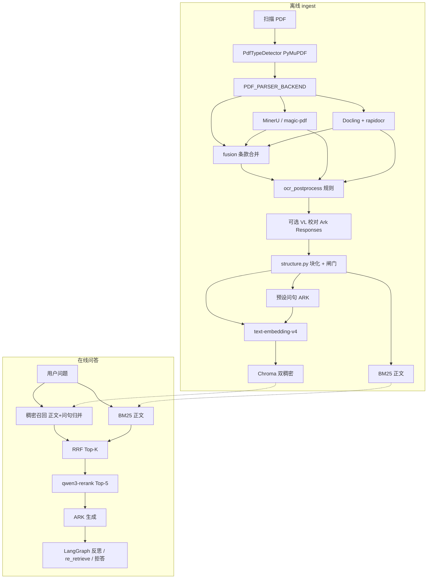

# 技术架构总览（2026-05-22）

> 本文档汇总近期实现的解析、OCR 质量、索引与在线 Agent 链路。分项规范见各 `*-spec.md`。

## 1. 端到端数据流



## 2. PDF 解析层（L1）

| `PDF_PARSER_BACKEND` | 技术 | 产物目录 | 说明 |
|----------------------|------|----------|------|
| `mineru` | MinerU / PaddleOCR | `artifacts/mineru/` | 默认；中文扫描件主力 |
| `docling` / `scheme_b` | Docling + **`rapidocr`** | `artifacts/docling/{书名}/` | macOS 勿 `auto`（ocrmac 中文极差） |
| `fusion` | MinerU ∥ Docling → `src/pdf/fusion.py` | `artifacts/parsed/fusion/*_report.json` | 按条款号合并、单通道补条、记录 `disagreements` |

**入库正文**以 `artifacts/parsed/md_ingest/{backend}/page_*.md` 为准，**不是** Docling 原始 `page_*.md` 缓存。

详见 [parser-backends.md](../ingest/parser-backends.md)。

## 3. OCR 质量（L2 + 可选 VL）

| 层级 | 实现 | 原则 |
|------|------|------|
| **L2 规则** | `src/pdf/ocr_postprocess.py` | `b/6`、`±/土`、条款号等；日志 `ocr_fixes.jsonl` |
| **L3 预置条文** | **已移除** | 不用业务外 JSON 补全标准原文 |
| **双通道 fusion** | `fusion.py` | 互补漏条（如 3.7）；不臆造 |
| **VL 校对** | `vl_corrector.py` + `ark_responses.py` | 仅分歧/缺口页；模型 `doubao-seed-2-0-pro-260215`；API：`POST /api/v3/responses`（`input_image` + `input_text`） |

详见 [ocr-quality-improvement.md](../ingest/ocr-quality-improvement.md)。

## 4. 结构化与分块

- **实现**：`src/pdf/structure.py`
- **Block**：按页 MD 解析 → `clause` / `table` / `paragraph`（条款行、表、章节段）
- **Chunk**：`chunker.py` 对每个 Block 按 ~700 token 滑动切（国标 PDF 通常 1 Block = 1 Chunk）
- **质量闸门 S1–S6**：字数、表块数、条款块数、覆盖率；失败则 `IngestError`
- **输出**：`artifacts/parsed/doc.json`

详见 [structure-spec.md](../ingest/structure-spec.md)、[indexing-and-retrieval.md](../retrieval/indexing-and-retrieval.md#分块策略)。

## 5. 索引：正文 + 问题双稠密

| 组件 | 内容 | 技术 |
|------|------|------|
| 正文向量 | 每个 `chunk.text` | DashScope `text-embedding-v4` → Chroma，`index_role=content` |
| 问句向量 | 每 chunk 生成 N 个预设问句 | ARK Chat JSON → embed → Chroma，`index_role=question`，id=`{chunk_id}#q{i}` |
| 稀疏检索 | **仅正文** | jieba + `BM25Okapi` → `artifacts/bm25_index.pkl` |
| 问句缓存 | 避免重复调 LLM | `artifacts/parsed/hypothetical_questions.json` |

**在线稠密召回**：扩大 Chroma `n_results`，按 `metadata.chunk_id` 将正文/问句命中**归并**到同一 chunk，再与 BM25 做 RRF；Rerank 与生成仍使用 **chunk 正文**。

开关：`INDEX_HYPOTHETICAL_QUESTIONS`（默认 `true`）。

详见 [indexing-and-retrieval.md](../retrieval/indexing-and-retrieval.md)。

## 6. 在线检索与 Agent

| 步骤 | 技术 |
|------|------|
| 稠密 + 稀疏 | Chroma（双稠密归并）+ BM25 → **RRF**（`rrf_k=60`）Top-12 |
| 精排 | DashScope **qwen3-rerank** Top-5（`compatible-api/v1/reranks`） |
| 硬拒答 | RRF/BM25 分数低于阈值 |
| 生成 / 反思 | 火山方舟 **ARK Chat**（`ARK_CHAT_MODEL`） |
| 元数据 boost / pin | `query_signals` + `_pin_required_after_rerank` | 表题/条款/OCR/外观/复合题评测对齐 |
| 编排 | **LangGraph**：retrieve（含 rerank+pin）→ generate → reflect → revise / rewrite_query / refuse |

详见 [indexing-and-retrieval.md](../retrieval/indexing-and-retrieval.md#4-检索守卫评测对齐)、[rerank-spec.md](../retrieval/rerank-spec.md)、[agent-and-refusal-spec.md](../agent/agent-and-refusal-spec.md)。

## 7. 评测与审计

- **题库**：`scripts/demo_questions.json`（9 题：范围/条款/表/复合/拒答/模糊/OCR/回归）
- **脚本**：`scripts/evaluate.py` → `artifacts/eval_report.json`
- **Token**：`artifacts/usage/*.jsonl`（含 `embed`、`index_hypothetical_questions`、`ocr_vl_correct` 等 stage）

## 8. 关键环境变量速查

```bash
# 解析
PDF_PARSER_BACKEND=fusion|mineru|docling
DOCLING_OCR_ENGINE=rapidocr
OCR_POSTPROCESS_ENABLED=true
OCR_VL_CORRECTION_ENABLED=false
ARK_VL_MODEL=doubao-seed-2-0-pro-260215

# 双稠密索引
INDEX_HYPOTHETICAL_QUESTIONS=true
INDEX_QUESTIONS_PER_CHUNK=2
INDEX_QUESTIONS_FORCE_REGENERATE=false
RETRIEVAL_DENSE_POOL_FACTOR=3

# 检索 / Agent
RETRIEVAL_TOP_K=12
RETRIEVAL_METADATA_BOOST=0.15
RERANK_TOP_N=5
MAX_RE_RETRIEVE=1
```

## 9. 产物目录对照

| 路径 | 含义 |
|------|------|
| `artifacts/mineru/`、`artifacts/docling/` | L1 原始 OCR |
| `artifacts/parsed/md_ingest/` | 入库前 Markdown（融合/后处理/VL 后） |
| `artifacts/parsed/doc.json` | 结构化 blocks + chunks |
| `artifacts/parsed/hypothetical_questions.json` | 预设问句缓存 |
| `artifacts/parsed/fusion/*_fusion_report.json` | 双通道审计 |
| `artifacts/chroma/` | 向量库（含正文+问句行） |
| `artifacts/bm25_index.pkl` | 稀疏索引（仅正文） |

## 10. 修订记录

| 日期 | 说明 |
|------|------|
| 2026-05-22 | 初版：fusion、VL Responses API、双稠密索引、架构总览 |
| 2026-05-26 | 在线链路补充 pin/metadata boost |
